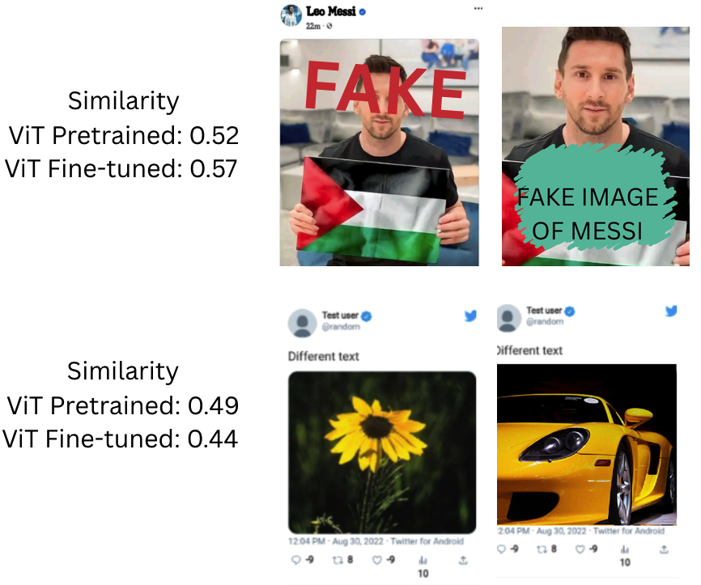

Example of how the fine-tuned Vision Transformers improves the retrieval of near-duplicates by increasing the similarity of modified images and decreasing the similarity of different images with the same layout.

Requirements: transformers, torch, pillow, numpy

Fine-tuned model: huggingface.co/rfrade/near_duplicate_retrieval_vit

